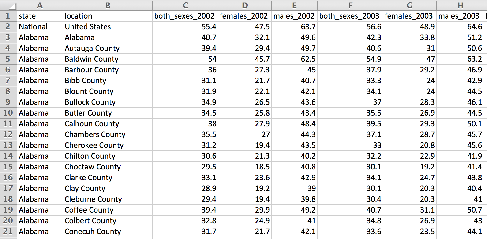

Data Wrangling
==============

In this challenge, you'll practice working with the `dplyr` package to answer questions about data on U.S. county level alcohol consumption patterns. In particular, you'll focus on these skills:

-   Reading and writing `.csv` files

-   Writing functions to perform repeated tasks

-   Using the `dplyr` package to perform `data.frame` manipulation, including:

    -   `select` specific columns
    -   `filter` down the rows
    -   `mutate` to add more columns
    -   `arrange` your rows in a particular order
    -   `summarize` different values for your columns
    -   `join` multiple `data.frame` elements together

As you write code to answer the questions throughout the assignment, please **put the answers in your comments**. There are a few optional **bonus** questions throughout. These can earn points that offset points missed, but **scores over 100% will not be awarded**.

The Data
--------

The data for this challenge contains estimates for alcohol consumption patterns at the U.S. county level each year from 2002 - 2012. More specifically, for each county, the data represents the prevalence (`prevalence = drinkers/adult_population`) of drinking in each county. The two measures of interest are:

> **Any Drinking**: At least one drink of any alcoholic bevarage in the past 30 days

> **Binge Drinking**: The consumption of more than four drinks for women or five drinks for men on a single occasion at least once in the past 30 days

Estimates are provided for males and females separately, as well as both sexes combined. The data comes from [this study](http://www.healthdata.org/research-article/drinking-patterns-us-counties-2002-2012) at the [Institute for Health Metrics and Evaluation](http://www.healthdata.org/), and was downloaded [here](http://www.healthdata.org/us-health/data-download) (I've already downloaded it and performed some formatting for you). Here is an [interactive visualization](http://vizhub.healthdata.org/us-health-map/) of the study results.

**Any** drinking and **binge** drinking are saved in separate `.csv` files, both the same format:

Set-up
------

At this point, you should feel comfortable forking and cloning this repository. If you've forgotten the steps, refer to the previous assignments.

-   Fork this repository, then clone your forked repository (*not* my original one) to your machine

Now you're ready to get started. Unlike previous assignments, you'll create you're own `assignment.r` file to use. In your `assignment.r` file, make sure to:

-   Set your working directory
-   Install and require the `dplyr` package
-   Create a new directory `outputs/`, in which you'll be writing `.csv` files
-   Read in your `data/any_drinking.csv` file
-   Read in your `data/binge_drinking.csv` file

In your `assignment.r` file, make sure to **comment clearly and often**.

Any drinking in 2012
--------------------

For this first section, we're going to focus in on data from the `any_drinking` data, and hone in on the most recent year of estimates (2012). In order to begin asking questions, you should do the following:

-   Create a `data.frame` that has the `state` and `location` columns, and all columns from 2012
-   Create a column that has the difference in male and female drinking patterns (for 2012)

Now you can ask some specific question about that data. Using the `dplyr` functions, answer the following questions:

-   Are there any locations where females drink more than males?
-   What is the location in which male and female drinking patterns are most similar?
-   What is the location in which the difference in drinking patterns is greatest?
-   For our reference, write the 2012 `data.frame` variable you're working with to a `.csv` file in your `output/` directory

As you've likely noticed, the `location` column includes national, state, and county level estimates. However, many audiences may only be interested in the state level data. Given that, you should do the following:

-   Create a new `data.frame` that is only the state level observations within your 2012 `data.frame`
-   Which state had the **highest** drinking rate for both sexes combined?
-   Which state had the **lowest** drinking rate for both sexes combined?
-   What was the difference in percentage of drinking between the hightest and lowest consumption states?
-   Write your 2012 state data to an appropriately named file in your `output/` directory

Repeated tasks for *Any Drinking* data
--------------------------------------

Very often in analysis/data-management, you'll be asked to perform the same task multiple times for different subsets of data. In these cases, it obviously makes sense to **write a function** to perform these tasks. Given this, do the following in your script:

-   Write a function that takes a state as a parameter, and saves a .csv file with only observations from that state (i.e., the counties in that state, and the state itself). Make sure the file you save in the `output` directory indicates the state name.
-   Demonstrate your function works by writing 3 `.csv` files of the states of your choice
-   Write a function that allows you to specify a year of interest, then saves a `.csv` file with all observations, but only the columns `state`, `location`, and data from the specified year. Again, make sure relevant information is specified in your filename.
-   Demonstrate your function works by writing 3 .csv files of the years of your choice
-   **Bonus**: without writing a loop, in one line of code, write a separate file for each of the 50 states (this will create 50 *different* files)
-   Write a function that allows you to specify a year and state of interest, that saves a csv file with observations from that state's counties, and only the columns `state`, `location`, and data from the specified year. Before writing the `.csv` file, you should sort the `data.frame` in **descending order** by the both\_sexes drinking rate in the specified year. Again, make sure the file you save in the `output` directory indicates the year and state.
-   Demonstrate your function works by writing 3 .csv files of the years/states of your choice

Exploring Binge Drinking Dataset
--------------------------------

In this section, we'll ask a variety of questions regarding our `binge_drinking` data.frame. In order to ask these questions, you'll want to do the following:

-   Create a dataframe with only the county level observations from the `binge_driking` dataset (i.e., exclude state/national estimates)
-   Create columns with the change in binge drinking from 2002 - 2012 for males and females (separately)

With this additional information, you should be able to ask the following questions of your dataset:

-   What is the average county level of binge drinking in 2012 for both sexes?
-   What is the minimum county level of binge drinking in each state (in 2012 for both sexes)? Write your answers to a `.csv` file
-   What is the maximum county level of binge drinking in each state (in 2012 for both sexes)? Write your answers to a `.csv` file
-   What is the county with the largest **increase** in male binge drinking between 2002 and 2012?
-   How many counties observed an increase in male binge drinking in this time period?
-   How many counties observed an increase in female binge drinking in this time period?
-   How many counties experience a rise in female binge drinking **and** a decline in male binge drinking?

Joining Data
------------

You'll often have to **join** different datasets together in order to ask more involved questions of your dataset. In this section, you'll perform the following tasks:

-   Before joining your datasets, you'll need to rename their columns that store your data. In each dataset, add a prefix (either `any_` or `binge_`) to the columns that store the drinking rates
-   Join your `any_drinking` and `binge_drinking` dataframes together.
-   Create a column of difference between `any` and `binge` for both sexes 2012
-   Which location has the greatest difference between `any` and `binge` drinking?
-   Which location has the smallest difference between `any` and `binge` drinking?

Ask your own questions
----------------------

Even in an entry level data analyst role, people are expected to come up with their own questions of interest (not just answer the questions that other people have). For this section, you should write a function that allows you to ask the same question on different subsets of data. For example, you may want to ask about the highest/lowest drinking level given a state or year. The purpose of your function should be evident given the input parameters and function name. You should suppliment this information with sufficient comments, and demonstrate that the function works by passing in different parameters to your function.

Submission
----------

Before submitting your assignment, please edit this `Readme.md` file to answer the following questions (feel free to delete the intstructions above, leaving only the answers to these questions):

##### 1. Did you receive any help from others (classmates, etc)? If so, please list who.

> Answer goes here!

##### 2. Approximately how many hours did it take you to complete this challenge?

> Answer goes here!

##### 3. On a scale of 1 (too easy) to 10 (too challenging), how difficult was this challenge?

> Answer goes here!

##### 4. Did you encounter any problems in this challenge we should warn students about in the future? How can we make the challenge better?

> Answer goes here!

Please submit this GitHub repository to <a href="https://canvas.uw.edu/courses/1023398/assignments/3079011" target="_blank">Canvas</a> as your assignment, and thanks for your hard work!
